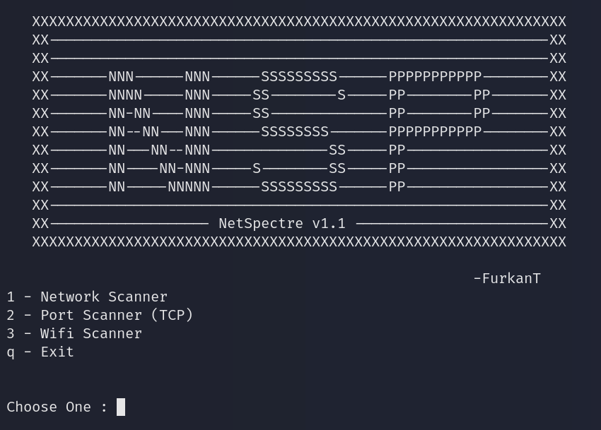

# 🔍 NetSpectre (Network and Port Scanner)

This is a simple but powerful **network scanner and port scanner** written in Python.  
It allows you to scan all active devices in your local network and check for open TCP ports on a specific target.

---

## 📌 Features

- 🖧 **Network Scanner**
  - Scan a given IP range (e.g., `192.168.1.0/24`)
  - Detects active devices
  - Shows hostname and MAC address (if available)
  - Saves results to `.txt` file

- 🚪 **Port Scanner**
  - Scan open TCP ports in a given range
  - Identifies the associated service (e.g., HTTP, SSH)
  - Multi-threaded and fast
  - Saves results to `.txt` file (optional)

---

## ⚙️ Requirements

- Python 3.13
- No external libraries required *(uses only built-in modules)*

---
## 📸 Example Output



---

## 🚀 How to Run

```bash
python3 NetSpectre.py


