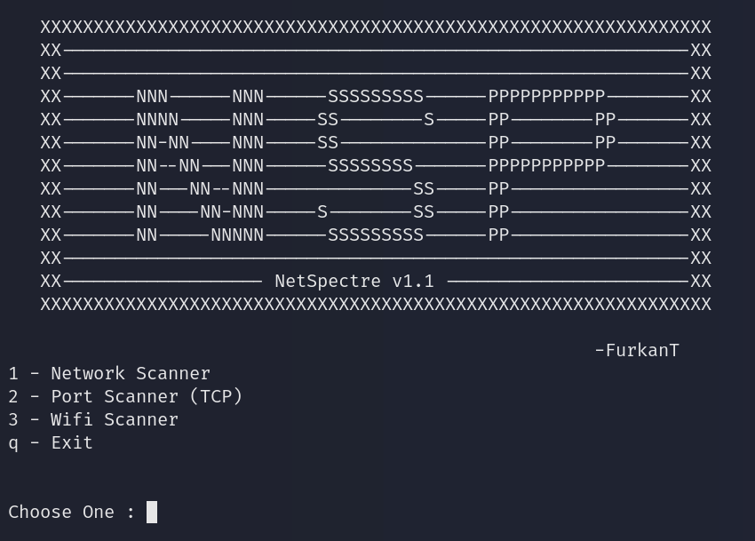

# 🔍 NetSpectre (Network and Port Scanner)

This is a simple but powerful **network scanner and port scanner** written in Python.  
It allows you to scan all active devices in your local network and check for open TCP ports on a specific target.

---

## 📌 Features

- 🖧 **Network Scanner**
  - Scan a given IP range (e.g., `192.168.1.0/24`)
  - Detect active devices
  - Show hostname and MAC address (if available)
  - Save results to `.txt` file

- 🚪 **Port Scanner**
  - Scan open TCP ports in a given range
  - Identify associated services (e.g., HTTP, SSH)
  - Multi-threaded and fast
  - Optional save results to `.txt` file

- 📡 **WiFi Scanner**  
  - Scan available WiFi networks  
  - **Requires monitor mode to be enabled on your wireless adapter**  
  - Compatible with Linux systems (monitor mode must be activated manually or via script)

---

## ⚙️ Requirements

- Python 3.13  
- No external libraries required *(uses only built-in modules)*  

> **Note for Kali Linux and similar distributions:**  
> If you try to install Python packages system-wide using `pip install`,  
> you may encounter an error like:  
>  
> ```
> error: externally-managed-environment
> ```  
>  
> This happens because the OS manages Python packages system-wide.  
> To avoid this, you should use a **virtual environment**:  
>  
> ```bash
> python3 -m venv venv
> source venv/bin/activate
> pip install <package-name>
> ```  
>  
> Alternatively, use `pipx` to install standalone Python applications.  
> For more information, see:  
> https://www.kali.org/docs/general-use/python3-external-packages/

---

## 📸 Example Output



---

# ⚠️ Disclaimer / License

This project is intended for **educational and research purposes only**.

The author is **not responsible** for any misuse or illegal activities caused by this software.

Use this software at your **own risk** and only in environments where you have **explicit permission**.

Unauthorized use of this software may violate local laws and regulations.

By using or distributing this software, you agree to take **full responsibility** for your actions.

---

## 🚀 How to Run

```bash
python NetSpectre.py